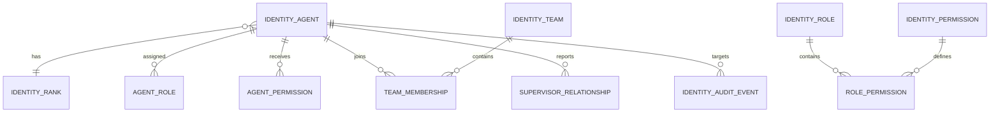
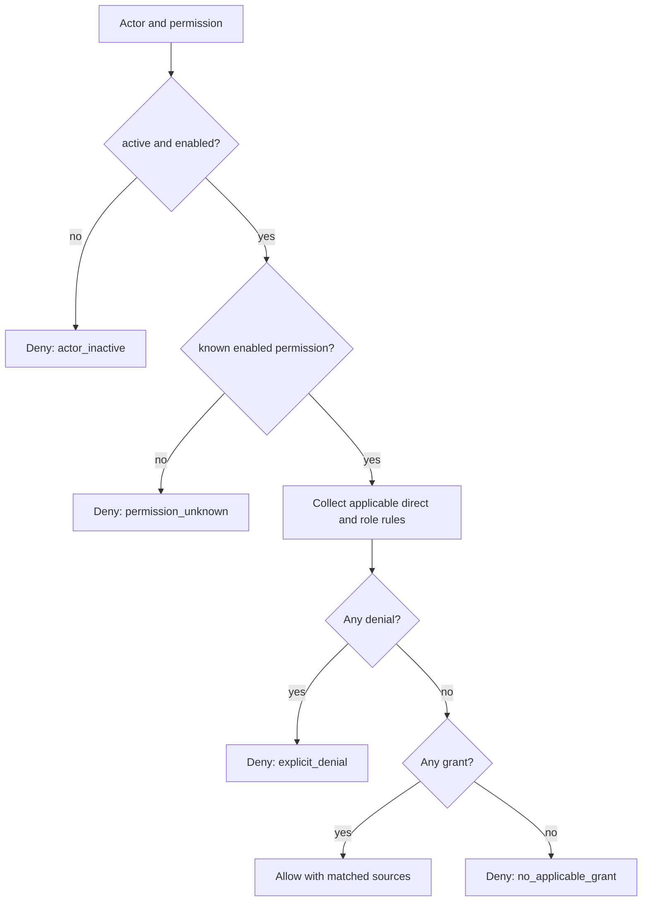
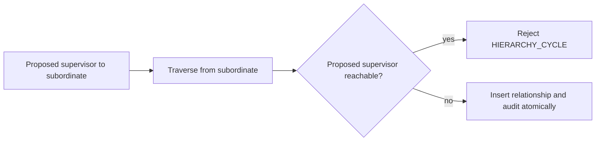

# Agent identity, hierarchy, and authorization

This subsystem is a durable organizational identity and authorization boundary. It does **not** authenticate users, execute agents, call models, assign tasks, track occupancy, or run approval workflows.

## Terms and architecture

An **identity** is stable even when its display name changes. Lifecycle (`provisioned`, `active`, `suspended`, `retired`) is durable and separate from operational status. Retirement is terminal. A **rank** provides deterministic ordering and optional explicit ceilings, but grants nothing by itself. A **role** is a reusable permission collection. A **capability** is descriptive eligibility and never authorization. Teams and directed supervisor relationships describe organization; hierarchy alone grants no authority.

ORM rows are normalized in `app.db.models`; request/response contracts are in `app.models.identity`; `IdentityService` owns transitions, assignments, hierarchy validation, audit insertion, and decisions. Routes only validate and delegate. Every mutation and its append-only identity audit row share one unit of work.

## Permission decisions

Permission keys are normalized `resource.action` definitions. Direct and role-derived assignments may allow or deny and may expire. Disabled definitions, revoked rows, future rows, and expired rows do not apply.

Explicit applicable denial always wins; there are no wildcards, score comparisons, rank superusers, display-name checks, or permissive exception fallbacks. Failure to evaluate returns `evaluation_failed`. Decisions return safe matched-source identifiers and a reason code. Resource-specific policy denial overrides broader permission grants. Unknown resources acquire no policy grant.

Role scope is an authorization boundary, not a default. A role assignment's `scope_type` must exactly match the role definition's `role_scope`: global roles are assigned globally without a `scope_id`, while project, team, and resource roles require a non-empty `scope_id` of that same type. No narrower-scope substitution is currently supported. A mismatch returns `ROLE_SCOPE_MISMATCH` with HTTP 409.

## Hierarchy

Relationships are `primary`, `secondary`, `temporary`, or `functional`. Self-supervision, duplicate relationships, more than one primary supervisor during overlapping effective intervals, and direct or multi-hop cycles are rejected. Cycle traversal intersects every edge's half-open interval (`starts_at <= time < expires_at`), with a missing expiration extending indefinitely; therefore scheduled non-overlapping reverse links are permitted while any concurrently effective path is rejected. Expired and revoked links do not block replacements. Traversal is deterministic and bounded to 100 levels.

## Resource and office access

Policies refer to typed external resources: rooms, doors, desks, seats, projects, tools, tasks, artifacts, and administrative functions. They do not create those resources. Structured office states map to presentation colors: `general` (green), `restricted` (blue), `temporary` (yellow), and `blocked` (red). Red is an unconditional applicable policy denial. Green never defeats denial or inactivity. Blue requires a matching policy. Yellow is a temporary policy boundary; live reservations are deliberately absent.

Desk permission, priority, reservation, and occupancy are distinct. This release evaluates desk use access only; priority policy, reservations, and occupancy remain future integrations and must not be inferred from a color.

## HTTP API

All routes live under `/api/identity`, use the standard data/meta envelope, stable domain errors, bounded pagination (`limit <= 100`), and deterministic sorting. APIs cover identity lifecycle, rank/role/permission/capability/team definitions, role and permission assignment, permission explanation, hierarchy creation/traversal, resource policies/evaluation, and filtered audit history. OpenAPI is authoritative for exact schemas.

## Adding policy

Create a permission definition, attach it to a reusable role or assign an explicit agent allow/deny, and evaluate it using the actor's immutable identity ID. Capabilities must be used separately for eligibility. New office resources need only a validated external reference and policy; rendering stays outside this package.

## Limitations and future boundaries

Team membership, capability persistence, delegation ceilings, approval ceilings, and generic policy tables establish schema boundaries, but this first service API does not execute delegation, approval, reservations, occupancy, projects, tools, or tasks. A future change may add narrow evaluators and team-role mappings without changing deny precedence. SQLite serializes local writes, while database uniqueness constraints provide final duplicate protection; deployments requiring stronger concurrent hierarchy guarantees should use a database with serializable transactions or advisory locking.
