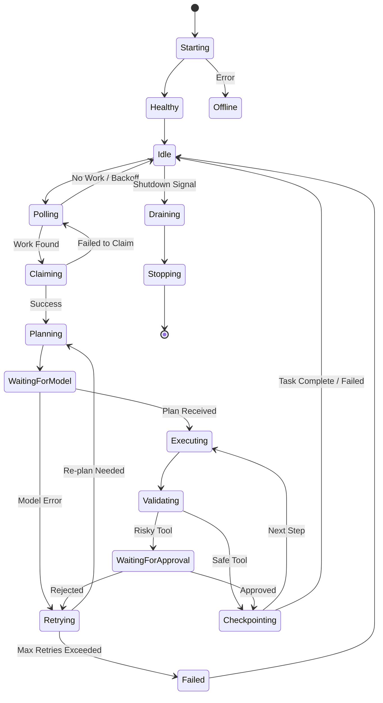
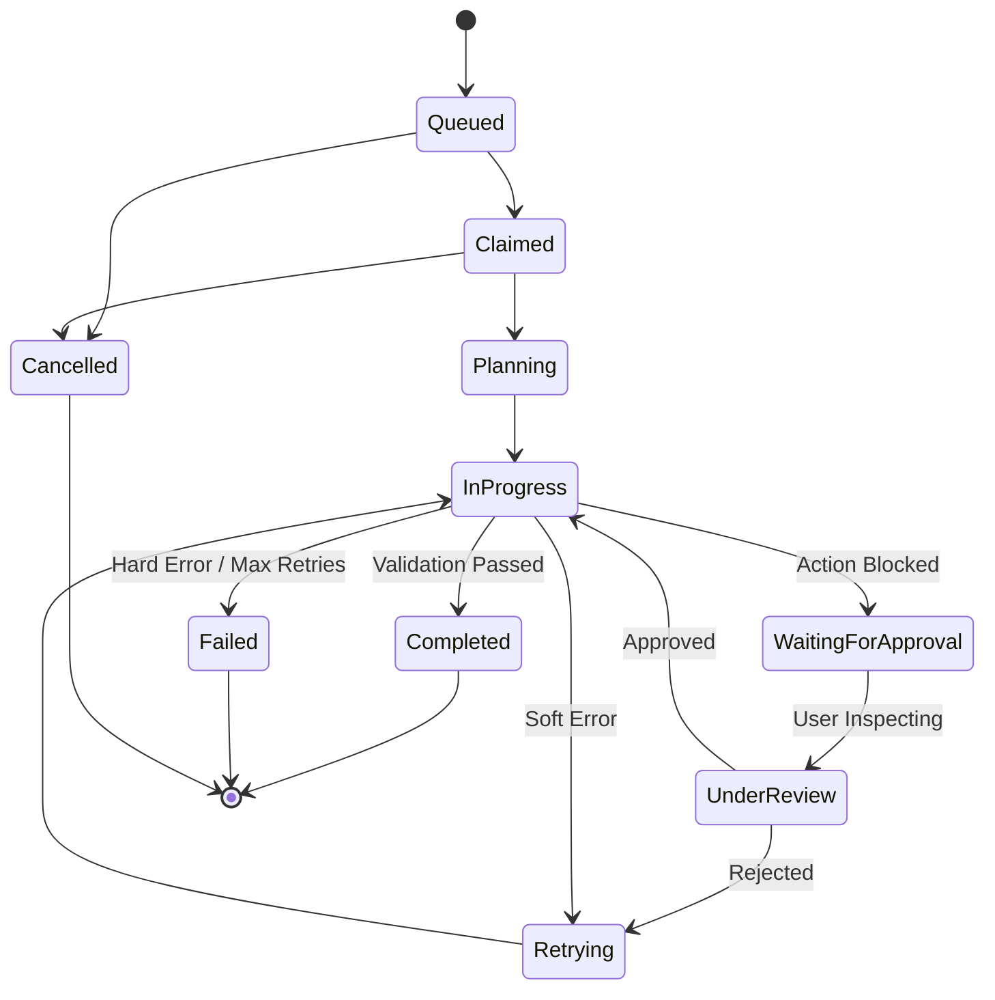

# 04 - Worker Lifecycle and State Machine

This document defines the complete lifecycle of the Phase 2B autonomous worker and the tasks it processes. The worker operates as a strict state machine, writing durable audits and checkpointing state on every transition.

## Worker State Machine

### Worker States Defined
- **Starting:** Initializing configuration, verifying database connection.
- **Healthy:** Internal checks passed.
- **Idle:** Waiting for the next poll interval.
- **Polling:** Querying SQLite for pending tasks.
- **Claiming:** Attempting an atomic compare-and-swap to lease a task.
- **Planning:** Preparing the context for the model.
- **Waiting for model:** HTTP request in flight to the local model provider.
- **Executing:** Iterating through steps or parsing responses.
- **Validating:** Checking schemas and tool constraints.
- **Waiting for approval:** Execution paused, waiting for human input.
- **Checkpointing:** Writing progress to SQLite.
- **Retrying:** Handling transient failures (network, malformed JSON).
- **Paused:** Suspended due to emergency stop.
- **Draining:** Finishing the current step before a clean shutdown.
- **Stopping / Offline:** Process terminating.

## Task State Machine

Task states are distinct from worker states. In Phase 2B, task state focuses on durable progress tracking.

### Claimed Concept Clarification
In Phase 2B, `claimed` is implemented as an internal lease concept within the persistence layer (an association of a `worker_id` and `expires_at` timestamp), rather than a public-facing task status. The public-facing status transitions from `queued` directly to `in_progress` (or `planning`) once claimed, simplifying the API surface while maintaining concurrency protection.

## Transitions and Durable Behavior

* **Legal Transitions:** A worker can only move from `Polling` to `Claiming`. It cannot go from `Idle` directly to `Executing`.
* **Illegal Transitions:** A `Completed` or `Failed` task cannot transition back to `InProgress`. They are terminal states.
* **Audit Events:** Every major transition (e.g., `Queued` -> `Claimed`, `WaitingForApproval` -> `InProgress`) must yield an append-only audit event in SQLite.
* **Durable Writes:** Moving from `WaitingForModel` to `Executing` requires a durable checkpoint. If the worker crashes, it resumes from the checkpoint rather than re-querying the model.

## Interruption and Recovery Behaviors

* **Process Crash:** If the worker crashes, the lease eventually expires. Upon restart, a worker reclaims the task and resumes from the last durable checkpoint.
* **Model Timeout:** Transitions the worker to `Retrying`. If retries are exhausted, the task transitions to `Failed`.
* **Lease Expiration:** If a worker's heartbeat fails and the lease expires, the task is returned to `Queued` or `Claimed` by another worker, recovering from the last checkpoint.
* **Emergency Stop:** Halts all transitions. Tasks remain in `InProgress` or `WaitingForApproval` but the worker transitions to `Paused`.
* **Graceful Shutdown:** The worker sets a `Draining` flag, finishes the current step, writes a checkpoint, and releases the lease before terminating.
* **Cancellation:** A user can cancel a task at any non-terminal state. The worker detects the cancellation during the next checkpoint or validation phase and halts.